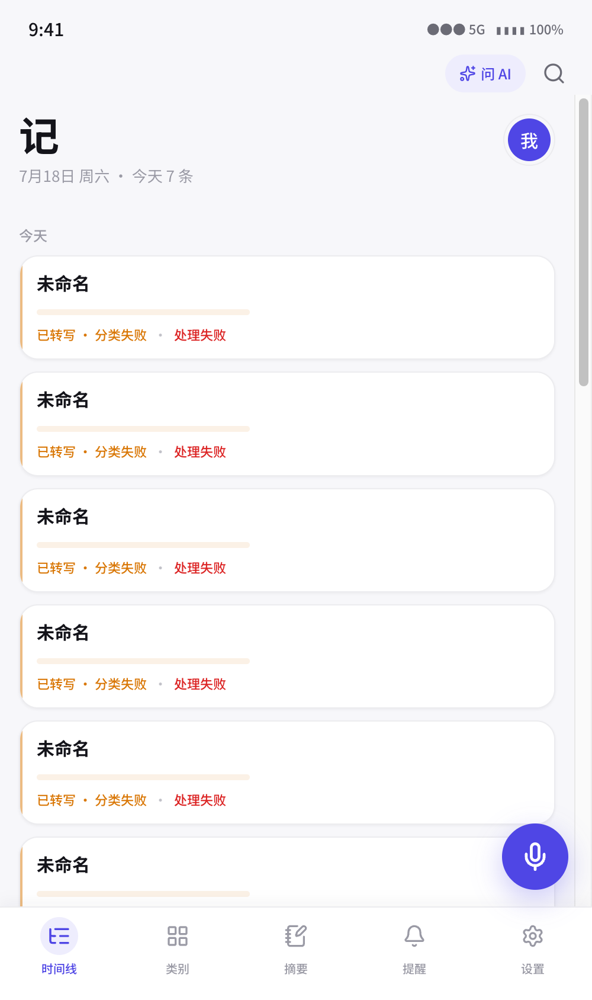
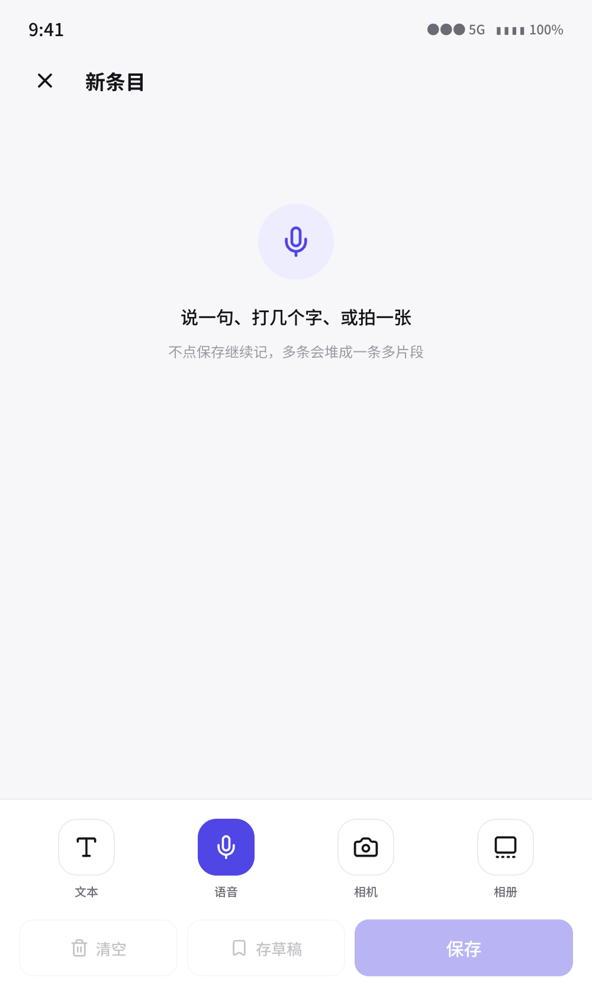
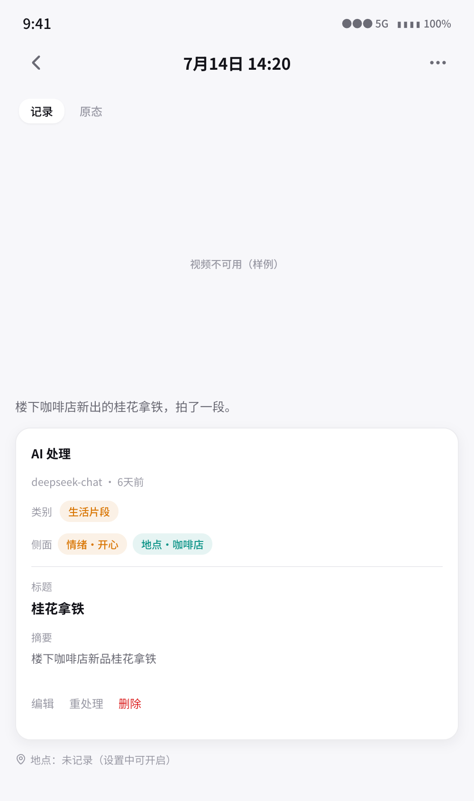
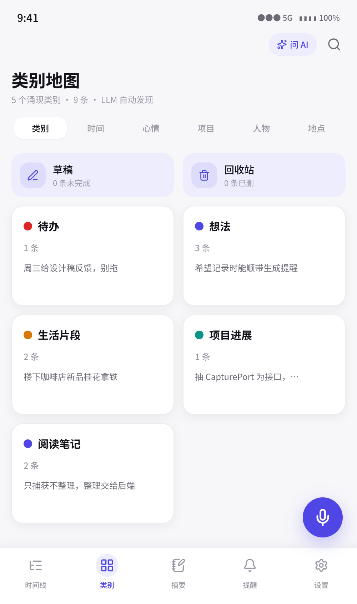
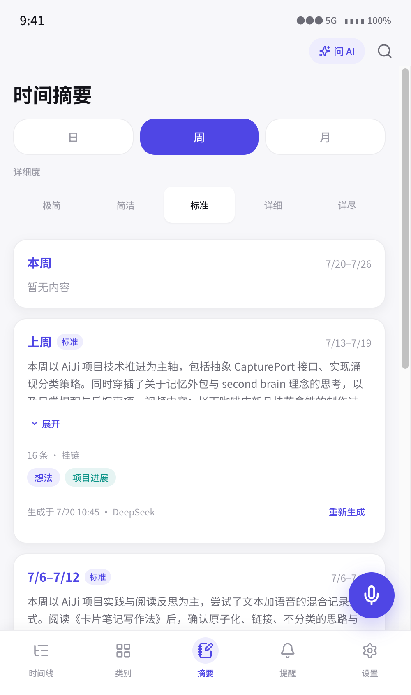
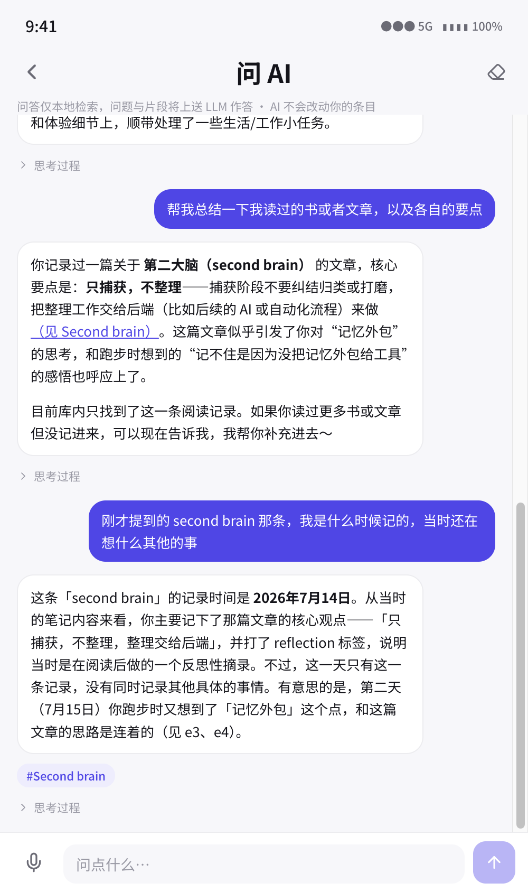
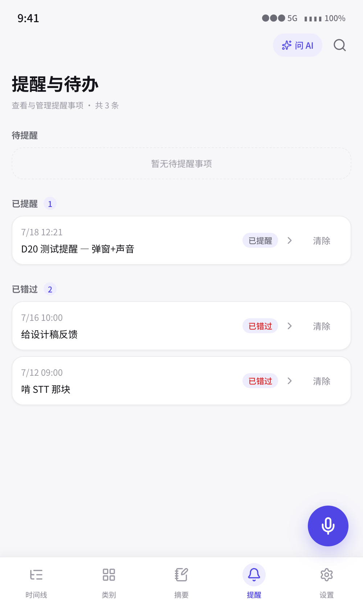
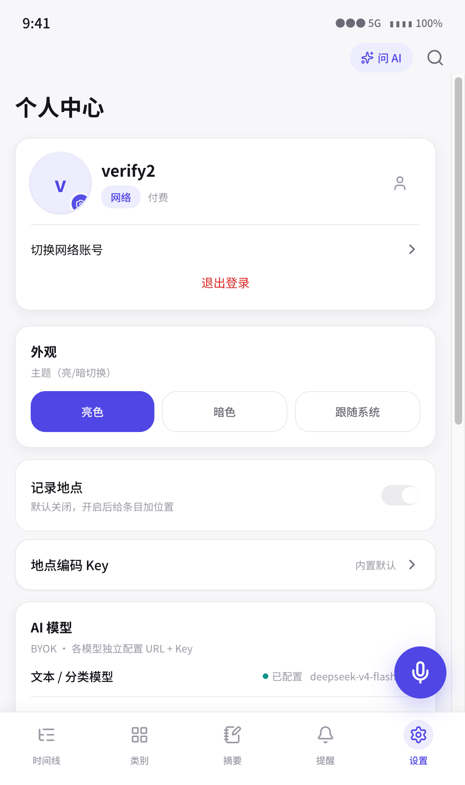

# AiJi · AI 记

> AI 辅助的「记」——多模态随手记（文本 / 语音 / 视频），云端 LLM（BYOK）自动涌现分类与聚合，本地优先存储。
> 移动优先 PWA，视口 390×844。产品 spec 见 `docs/superpowers/specs/2026-07-15-aiji-design.md`（PRD，8 节）；工程约束见 `CLAUDE.md`。

## 安装

- **Android APK**：下载 [最新版](https://github.com/cq-dong/AiJi/releases/latest/download/aiji.apk)（tag `v*` 自动构建），允许「未知来源」后安装。装好后在「设置 → 关于 AiJi」可检查更新并一键升级。
- **PWA（浏览器）**：访问在线地址，浏览器「添加到主屏」即可。

## 功能一览

> 八个核心页面,从随手记一条到 AI 帮你整理、检索、提醒。每一屏都在为「最低摩擦地把脑子里的东西落地」服务。

<table>
  <tr>
    <td width="50%" align="center"><br/><b>首页 · 时间线</b></td>
    <td width="50%" align="center"><br/><b>采集 · 多模态随手记</b></td>
  </tr>
  <tr>
    <td colspan="2">
      <b>左 · 首页时间线</b>:所有「记」按时间倒序铺开,每条带 AI 涌现的类别色 chip 与摘要。不需要先选类别、不需要写标题——记完即走,AI 在后台默默分类。<br/>
      <b>右 · 采集页</b>:文本 / 语音 / 图片 / 视频同框输入。语音走 DashScope Paraformer WebSocket 实时转写,图片走 VLM 视觉理解,一次记一条异构内容。
    </td>
  </tr>
  <tr>
    <td width="50%" align="center"><br/><b>详情 · AI 自动整理</b></td>
    <td width="50%" align="center"><br/><b>类别 · 涌现式策展</b></td>
  </tr>
  <tr>
    <td colspan="2">
      <b>左 · 详情页</b>:原文 + AI 摘要 + 涌现类别 / 标签 / 情绪 / 实体 / 地点 + 媒体回放。AI 面板可手动重跑,失败不伤原文。<br/>
      <b>右 · 类别页</b>:类别不是预定的,是从你的内容里涌现出来的。列表 / 看板双视图,合并 / 重命名 / 新增,按类别一键 .zip 导出。
    </td>
  </tr>
  <tr>
    <td width="50%" align="center"><br/><b>摘要 · 多模态聚合</b></td>
    <td width="50%" align="center"><br/><b>问 AI · 带思维链检索</b></td>
  </tr>
  <tr>
    <td colspan="2">
      <b>左 · 摘要页</b>:LLM 把一段时间内的条目聚合成结构化摘要,地点聚类成地图,图片 / 视频内容直接附在摘要末尾——一段时间的全貌一目了然。<br/>
      <b>右 · 问 AI</b>:对全部「记」自然语言提问。两轮 LLM(理解→检索→组织)+ 本地多面召回 + markdown 渲染,思维链默认折叠可展开,答得有据。
    </td>
  </tr>
  <tr>
    <td width="50%" align="center"><br/><b>提醒 · heads-up 横幅</b></td>
    <td width="50%" align="center"><br/><b>设置 · BYOK + 自更新</b></td>
  </tr>
  <tr>
    <td colspan="2">
      <b>左 · 提醒页</b>:LLM 从文本识别待办意图 → 用户确认 → 定时推送。自建 HeadsUpNotifier 插件(<code>PRIORITY_HIGH</code> + AlarmManager exact 排程),App 在前台 / 后台 / 被杀都弹 heads-up 横幅,错过自动补推。<br/>
      <b>右 · 设置页</b>:BYOK 自带 LLM / STT / VLM 密钥(明文 localStorage),内置高德地理编码 Key 开箱即用。「关于 AiJi」检查 GitHub 最新版一键升级,「使用反馈」直达 GitHub Issue。
    </td>
  </tr>
</table>

## 1. 这是什么

AiJi（AI 记）是一个**通用的「记」的工具，不是日记**。条目异构：生活片段 / 跳脱想法 / 项目进展，三种只是举例说明异构，**不是固定枚举**。

三条产品身份铁律（不可动摇）：

- **类别由内容涌现**——不预定大类。LLM 从内容发现类别，用户可策展（合并 / 重命名 / 新增）。代码不硬编码具体类别集。
- **情绪不是轴**——情绪只是众多可被 LLM 检测的**可选侧面**之一，不当独立导航轴、不当强制采集字段。
- **身份稳定**——非日记 / 异构捕获 / 分类涌现；具体类别集由用户内容决定。

核心闭环：**记 → 采音 / 文本 → STT → 落库(Dexie + OPFS) → AI 分类 / 聚合 → 各屏查看 → 导出 / 分享**，外加 **AI 提醒**（前台 Notification 定时：LLM 识意图 → 用户确认 → 调度 → 到点 fire / 错过补推·标 missed）。

## 2. 功能

- **多模态采集**：文本 / 语音（DashScope Paraformer WebSocket STT）/ 图片（多模态 VLM 视觉分类）
- **AI 分类与聚合**：DeepSeek LLM BYOK，保存即入队，断网不丢，LLM 失败只伤 AI 层
- **AI 提醒**：LLM 从文本识提醒意图 → 用户确认 → 定时 Notification；错过补推，>1h 标 missed；可 snooze / dismiss
- **AI 问答检索**：两轮 LLM + 本地召回 + markdown 渲染 + 语音输入
- **类别管理**：多视图（列表 / 看板）、合并 / 重命名、按类别 .zip 导出
- **本地优先存储**：Dexie（IndexedDB）存条目元数据 + OPFS 存媒体 blob；30 天回收站、多草稿
- **导出 / 分享**：.zip 打包（手写 STORE + CRC32，无新依赖）+ Web Share API
- **PWA 离线壳**：vite-plugin-pwa + manifest + 192/512 icons + autoUpdate SW
- **Android APK**：Capacitor 壳 + GitHub Actions CI 自动构建发版（tag 触发）
- **应用内自更新**：原生壳内检查 GitHub 最新版 + 一键下载安装（自定义 ApkInstaller 插件）
- **提醒 heads-up 横幅**：自建 HeadsUpNotifier 插件，前后台/被杀均弹横幅
- **使用反馈**：设置页提建议 + 截图 → GitHub Issue
- **BYOK**：用户自带 LLM / STT / VLM 密钥，明文 localStorage（自担风险，见 roadmap 后置决策）

## 3. 技术栈与架构

React 19 + Vite 8 + TypeScript（strict）+ Tailwind v3 + react-router-dom 7 + Zustand + TanStack Query + Dexie（IndexedDB）+ OPFS（媒体）。单测 Vitest；E2E Playwright / chrome-devtools-mcp。

分层 + 端口（PWA 无关，Capacitor 退路）：

```
UI 层 (React)          纯展示 + 视图状态，无 I/O
应用层 (Zustand+TanQuery) 视图状态 / 编排 / 采集→落库→入队
Domain 层 (纯 TS，零 I/O)  条目模型 / 涌现分类规则 / 标签去重
Port 端口 (接口)          CapturePort / SttPort / StoragePort / LlmPort / SecretStorePort
适配层 (PWA 实现)         DexieStorage · webCapture · DashScope STT · DeepSeek Llm · VLM · localStorage secrets
处理管线 (后台、可恢复)    保存即落库 → AI 入队 → 分类 → 聚合，断网不丢，LLM 失败只伤 AI 层
```

**关键隔离**：Domain + Port 不绑 PWA API。移动端 PWA 采集 / 存储不过 → 只换 CapturePort / StoragePort 的 Capacitor 适配器，UI / Domain / 管线不动。

## 4. 目录布局

```
src/
  ui/
    layout/        AppShell.tsx (MainLayout + BareLayout)
    components/    design-system 原语（共享，只读给屏实现）
    screens/       home/ capture/ detail/ categories/ summary/ search/ settings/ onboarding/
  app/             router.tsx, store.ts(Zustand), query.ts(TanStack), di.ts(端口注入根)
  domain/          types.ts (Entry/EntryAi/Category/Tag/Aggregate/Settings, 零 I/O)
  ports/           index.ts (5 个端口接口)
  adapters/        mockStorage.ts + 真实适配（DexieStorage / webCapture / dashScope STT / deepSeek Llm / VLM）
  data/            db.ts (Dexie schema), seed.ts (样例)
docs/
  superpowers/specs/   PRD
  design/              各功能设计文档（chat / write / multimodal / account / icon / splash）
  acceptance/          验收记录
  roadmap.md           开发路线图（已完成 / 在做 / 后置 三态）
```

## 5. 开发

```sh
npm install
npm run dev          # http://localhost:5173（视口 390×844 调试）
npm run typecheck    # tsc -b（lead 集成用）
npm run build        # tsc -b && vite build
```

并行子智能体自检用 `npx tsc -p tsconfig.app.json`（**不要**用 `npm run typecheck` / `tsc -b`，后者写共享 tsbuildinfo 缓存，并发会竞态）。

## 6. 分支更新日志

> **约定**：每开一条新分支，在本节追加一段，写明「相比父分支主要更新了什么功能」。格式：
>
> ```
> ### <分支名>（基于 <父分支>，<日期>）
> **主要更新**
> - <功能点 1，附 commit 短码>
> - <功能点 2>
> ...
> **后续 / 待办**
> - <本分支未完成或留给下条分支的>
> ```

### v2.0（基于 v1.5，2026-07-20）

**主要更新**——Android 原生壳 + GitHub 分发 + 应用内自更新 + 真机缺陷全量修复

- **Capacitor APK 壳 + GitHub Actions CI 发版**：PWA 包进 Capacitor Android 壳（`com.cqdong.aiji`，androidScheme https），tag `v*` 触发 CI 自动构建 APK 上传 Release（`307bfab`）
- **应用内自更新**：`AppUpdatePort` 端口 + 平台分流适配器；自定义 `ApkInstaller` 插件（OkHttp 原生下载绕 CORS + FileProvider 拉起系统安装器）；设置页「关于 AiJi」检查最新版 + 一键下载安装（`307bfab` / `8c9dea8`）
- **品牌图标 + 开屏页**：app icon / splash 打入 APK 资源，含开源信息与免责声明（`6b9692a`）
- **release 签名**：release keystore 存 GitHub secret + 本机备份，固定签名修覆盖安装冲突（`b3f8d60`）
- **使用反馈**：设置页 → /feedback 多建议 + 图片 → GitHub Issue（孤儿分支存图 + contents API，token CI 烘进 APK）（`3aed618` / `9199108` / `44f1d45`）
- **内置高德地理编码 Key**：开箱即用地址解析，免用户自配（`7f51227`）
- **AI 问答深度优化**：召回加地点面 + facets 多面搜索 + 实体抽取 + 自然对话 prompt + 思维链可展开（理解→检索→组织，默认折叠）+ 真实错误原因 + 抗截断容错（`1758945` / `8c32780` / `4a4b5f5`）
- **多模态摘要附媒体内容**：摘要末尾附「图片内容：xxx / 视频内容：xxx」；类别地图地点聚类（`7cf5d03` / `33480b2`）
- **提醒 heads-up 横幅**：自建 `HeadsUpNotifier` Capacitor 插件（`PRIORITY_HIGH` + `IMPORTANCE_HIGH` + AlarmManager exact 排程），绕过 `@capacitor/local-notifications` 写死 `PRIORITY_DEFAULT` 不弹横幅的根因；前后台/被杀均触发（`f3fc921` / `ceae6ae`）
- **GitHub API 403 修复**：原生平台走 `CapacitorHttp` 绕 WebView User-Agent 限制（`33480b2` / `151d4f9`）
- **SW 缓存致更新后首启显旧版修复**：原生壳注销 PWA Service Worker，每次从 APK 文件系统加载最新 bundle（`4a4b5f5`）
- **真机缺陷全量修复**：D1-D30 共 30+ 条真机回归（安全区原生注入 / 通知声音 / 权限流程 / 铺屏比例 / 地址 / 失败重试 / 提醒弹窗 等）（`0926f9c` / `4d7bb1b` / `840e089` / `4ae8b15` / `0948a8b` / `f1d2d33` / `930c6e0`）

**后续 / 待办**

- 移动端 A1/A2 假设持续验证（麦克风 / 摄像头 / IndexedDB 配额，iOS 尤甚）
- 账号系统实装（设计见 `docs/design/account-and-monetization.md`）
- dark mode（后置到 MVP 后）

### v1.5（基于 main，2026-07-17）

**主要更新**

- **AI 检索问答**：两轮 LLM + 本地召回 + markdown 渲染 + 语音输入（`c047e38`）
- **多模态视觉 + 通用 BYOK + STT 双模**：图片采集 + VLM 视觉分类；统一 BYOK 密钥管理；DashScope Paraformer WS STT + WebSpeech 双模（`0f54c56`）
- **独立 VLM 端点 + 自定义模型下拉**：视觉分类走单独 VLM 端点，模型可选（`adfddcb`）
- **采集重设计 + 提醒创建三联修 + chat 语音 + 各屏打磨**：WIP checkpoint（`4ef0b16`）
- **按类别 .zip 导出**（`18b7fb6`）
- **账号与变现设计文档 + app icon / splash 规格 + 发布研究**（`8d4ff5d`）
- **根目录测试截图归档 + gitignore + CLAUDE.md 协作铁律 + 应用图标**（`6b1e6ea`）

**后续 / 待办**

- 账号系统实装（已在 `worktree-feat-account-system` 分支开工，设计见 `docs/design/account-and-monetization.md`）
- 移动端真机 A1/A2 验证（麦克风 / 摄像头 / IndexedDB 配额，iOS 尤甚）；不过则走 Capacitor 原生壳或砍视频
- dark mode（后置到 MVP 后，单独阶段做）

### v1.0（初始版本，2026-07-15）

**主要更新**

- 脚手架：React 19 + Vite + TS strict + Tailwind + Zustand + TanQuery + Dexie
- 24 屏 UI 层（Figma → 代码，5 并行子智能体铺屏）
- Dexie StoragePort 落库 + OPFS 存音频 blob + 详情播放
- PWA CapturePort（getUserMedia 麦克风 + WebSpeech 实时 STT）
- settings theme / recordLocation 持久化
- Elevated-soft 质感打磨（tokens + primitives + 全屏 polish）
- AI 提醒 MVP（LLM 识意图 → 确认 → 调度 → Notification fire / 错过补推）
- .zip 导出 + Web Share API + PWA 离线壳

详见 `docs/roadmap.md`。
