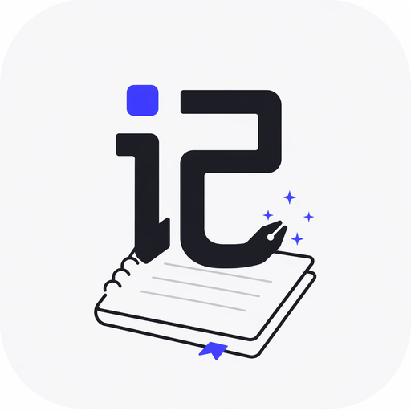
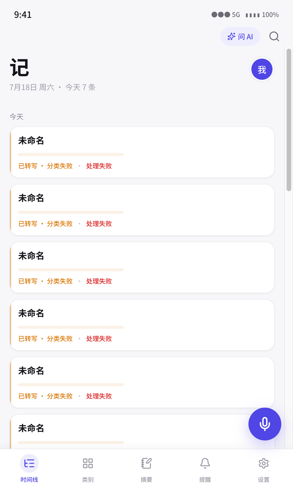
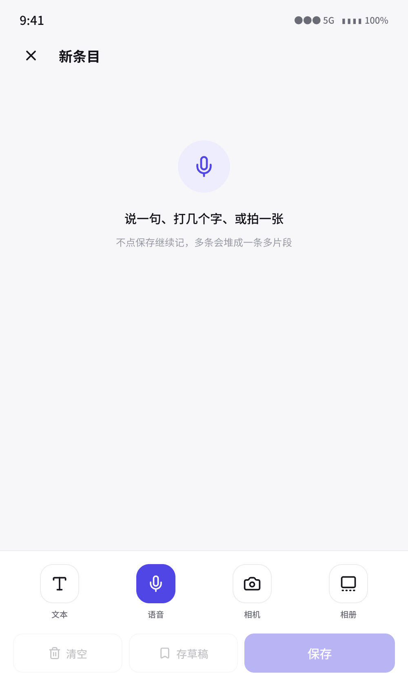
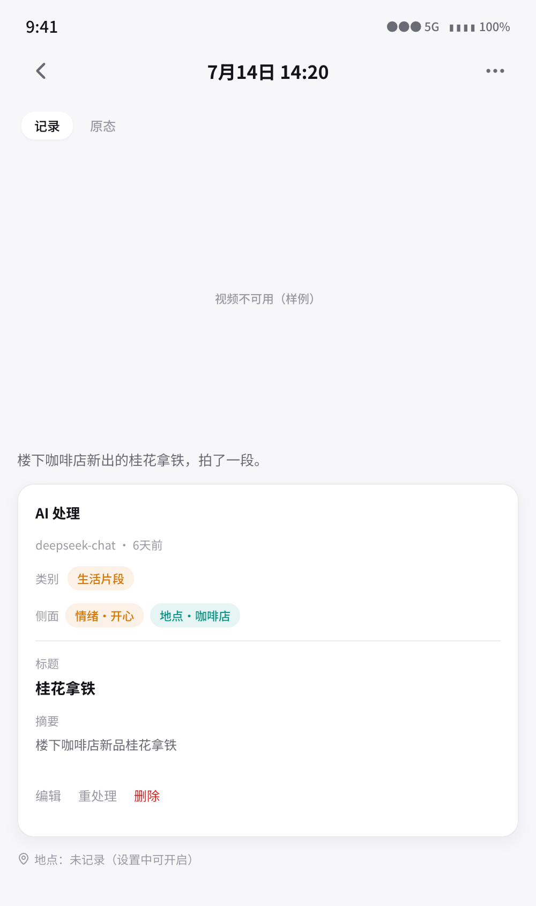
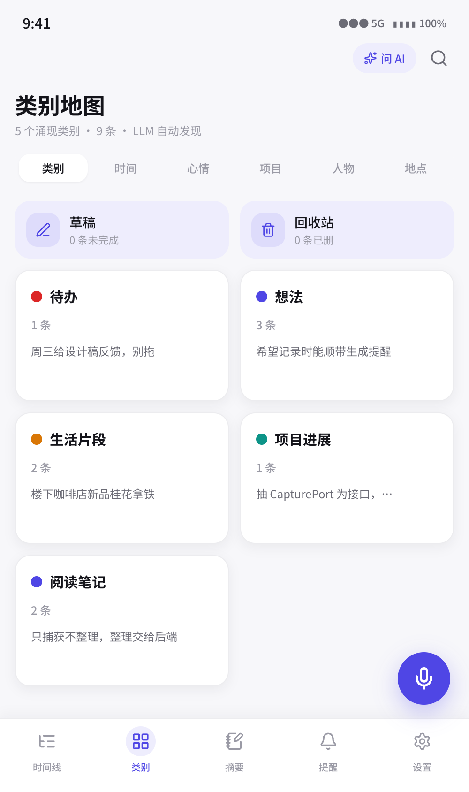
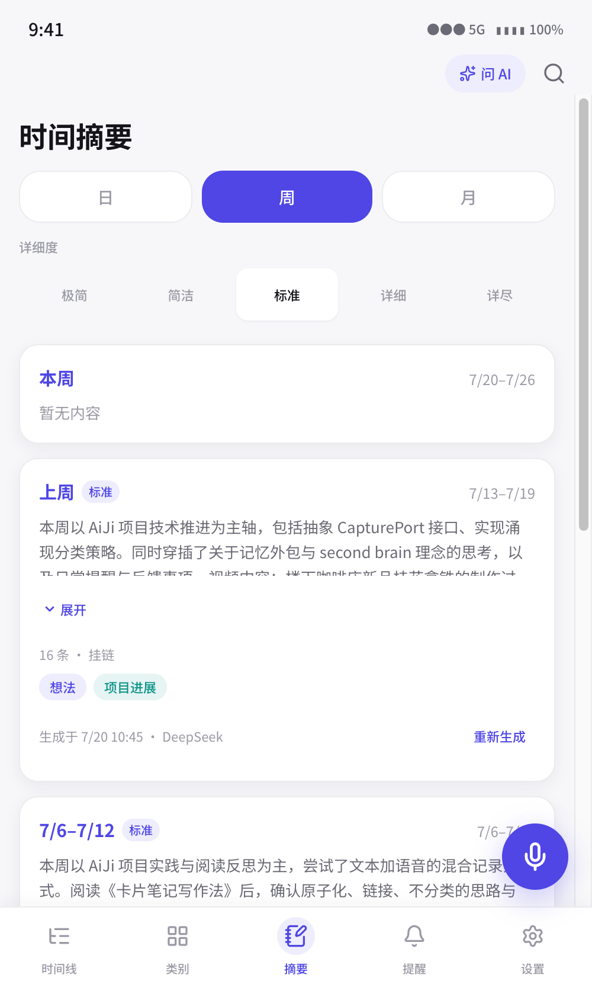
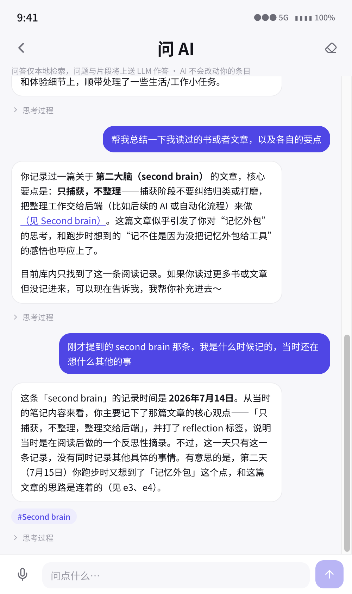
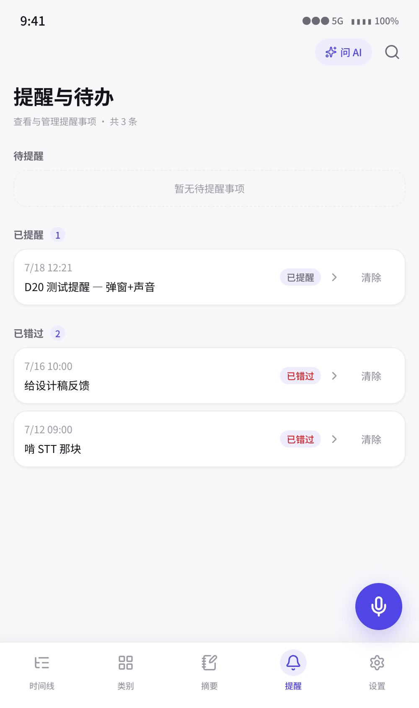
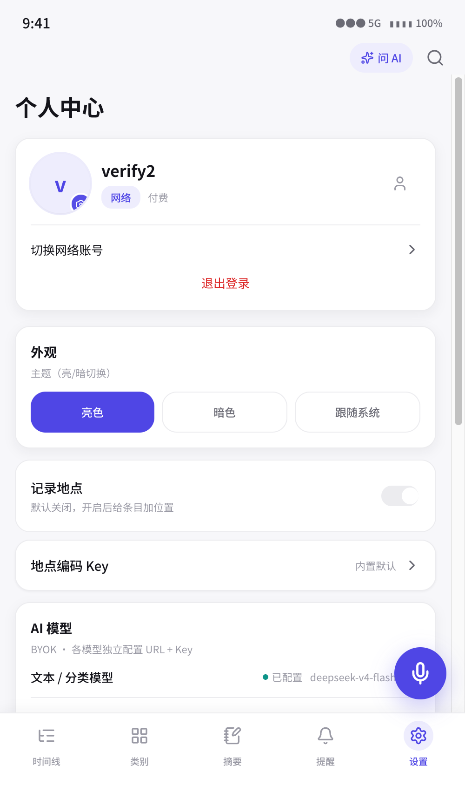

<div align="center">



# AiJi · AI 记

**随手一记，AI 整理。**

文本 / 语音 / 图片 / 视频多模态捕捉 · 本地优先存储<br/>
AI 涌现分类、聚合摘要、提醒待办——还能陪聊

[](https://github.com/cq-dong/AiJi/releases)
[](https://github.com/cq-dong/AiJi/actions/workflows/build-apk.yml)
[](#-安装)
[](#-技术栈与架构)

[**⬇️ 下载 APK**](https://github.com/cq-dong/AiJi/releases) ·
[**📸 功能一览**](#-功能一览) ·
[**📖 产品 PRD**](docs/superpowers/specs/2026-07-15-aiji-design.md) ·
[**🗺 路线图**](docs/roadmap.md)

</div>

---

## 📸 功能一览

<div align="center">
  
  
  
  
  <br/>
  
  
  
  
</div>

<p align="center">
  <sub>首页时间线 · 多模态采集 · AI 详情 · 涌现类别 · 聚合摘要 · 问 AI · 智能提醒 · 设置</sub>
</p>

## ✨ 为什么是 AiJi

AiJi（AI 记）是一个**通用的「记」工具，不是日记**。生活片段、跳脱想法、项目进展——什么都能往里扔。不需要先选类别、不需要写标题，记完即走，剩下的交给 AI。

三条产品铁律：

- 🌱 **类别由内容涌现**——不预定大类。LLM 从你的内容里发现类别，你可策展（合并 / 重命名 / 新增）。
- 🧭 **情绪不是轴**——情绪只是可被 LLM 检测的可选侧面之一，不做独立导航、不做必填字段。
- 🧩 **条目天然异构**——文本 / 语音 / 图片 / 视频一次记一条，异构是一等公民。

核心闭环：**记 → 落库 → AI 分类 / 聚合 → 各屏查看 → 检索 / 导出**。保存即落库，断网不丢；LLM 失败只伤 AI 层，原文永远在。

## 🚀 功能

| | |
|---|---|
| 🎙️ **多模态采集** | 文本 / 语音（Paraformer 实时 STT）/ 图片（VLM 视觉理解）/ 视频同框输入 |
| 🧠 **AI 分类与聚合** | 类别 / 标签 / 摘要 / 实体自动产出，后台可恢复管线，可手动重跑 |
| 💬 **AI 陪伴问答** | SSE 流式回答，意图驱动（回忆 / 天气 / 搜索 / 待办确认卡），语义召回 + 滚动摘要，越聊越懂你 |
| 🔔 **智能提醒** | LLM 识待办意图 → 确认 → 定时 heads-up 横幅（前台 / 后台 / 被杀均弹），错过补推 |
| ☁️ **账号与云同步** | 注册登录、套餐配额，local-first 全量云同步（outbox / tombstone / 离线补传） |
| 🗂️ **类别策展** | 列表 / 看板双视图，按类别 .zip 导出 / 导入，30 天回收站 + 多草稿 |
| 📱 **PWA + Android** | 移动优先 PWA（390×844），Capacitor Android 壳，tag 推送 CI 自动构建发版 |
| 🔄 **应用内自更新** | 检查 GitHub 最新版 + 原生下载安装，一键升级 |
| 🔑 **BYOK 或内置云** | 自带 LLM / STT / VLM 密钥，或用内置云端点开箱即用 |
| 🫙 **录音豆预留** | RecordingDonglePort 硬件录音接入端口，mock 驱动可测 |

## 🏗 技术栈与架构

React 19 · Vite 8 · TypeScript (strict) · Tailwind v3 · react-router-dom 7 · Zustand · TanStack Query · Dexie (IndexedDB) · OPFS · Vitest · Playwright · Capacitor · Hono（云端）

分层 + 端口（平台无关，Capacitor 退路）：

```
UI 层 (React)             纯展示 + 视图状态，无 I/O
应用层 (Zustand+TanQuery)  编排 / 采集 → 落库 → 入队
Domain 层 (纯 TS，零 I/O)   条目模型 / 涌现分类规则 / 标签去重
Port 端口 (接口)            Capture · Stt · Storage · Llm · SecretStore …
适配层                     DexieStorage · Paraformer STT · OpenAI 兼容 LLM · VLM · 云对接
处理管线 (后台、可恢复)      保存即落库 → AI 入队；断网不丢；LLM 失败只伤 AI 层
```

**关键隔离**：Domain + Port 不绑平台 API。移动端某项能力不过 → 只换对应端口的 Capacitor 适配器，UI / Domain / 管线不动。

## 📥 安装

**Android APK（推荐）**——到 [Releases](https://github.com/cq-dong/AiJi/releases) 下载最新 `aiji.apk`，允许「未知来源」安装。装好后在「设置 → 关于 AiJi」可检查更新并一键升级。tag `v*` 推送即由 CI 自动构建发布（`-rc` 为预发布测试包）。

**PWA / 本地开发**——

```sh
npm install
npm run dev              # http://localhost:5173（建议 390×844 视口调试）
npm run build            # 产物可自托管为 PWA
cd server && npm run dev # 云端后端（账号 / 同步 / 内置 AI，可选）
```

## 📚 文档

| 文档 | 位置 |
|---|---|
| 产品 PRD（8 节） | [docs/superpowers/specs/2026-07-15-aiji-design.md](docs/superpowers/specs/2026-07-15-aiji-design.md) |
| 开发路线图 | [docs/roadmap.md](docs/roadmap.md) |
| 更新日志（分支历史） | [docs/CHANGELOG.md](docs/CHANGELOG.md) |
| 功能设计文档 | [docs/design/](docs/design/) |
| 工程约束（AI 协作者） | [CLAUDE.md](CLAUDE.md) · [AGENTS.md](AGENTS.md) |

---

<div align="center">
  <sub>AiJi —— 把脑子里的东西，最低摩擦地落地。</sub>
</div>
